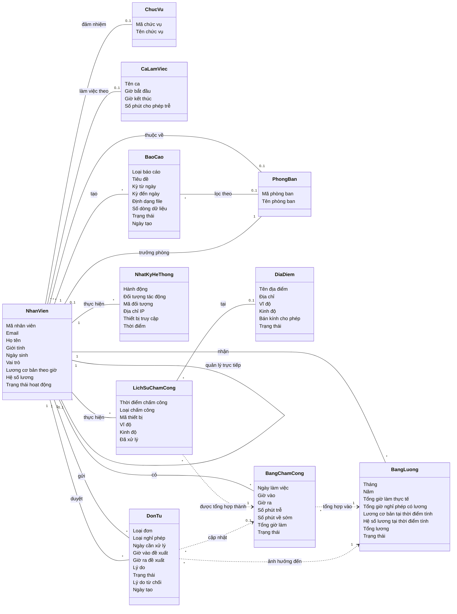

# Domain Analysis Model (DAM) — Hệ thống HRIS

**Domain Analysis Model** (Mô hình phân tích miền) mô tả các **khái niệm nghiệp vụ** (concept) và **mối quan hệ** giữa chúng trong lĩnh vực quản lý nhân sự, **không** đi vào chi tiết cài đặt (không có phương thức, không có kiểu dữ liệu kỹ thuật, không có khóa ngoại kỹ thuật).

Mục tiêu của DAM:
- Giao tiếp với khách hàng / người dùng nghiệp vụ.
- Làm nền tảng cho Sequence Diagram và Design Class Diagram.
- Phản ánh "thế giới thực có gì", không phải "code tổ chức ra sao".

---

## 1. Sơ đồ Domain Analysis Model

---

## 2. Danh sách khái niệm (Concept List)

| # | Khái niệm | Mô tả nghiệp vụ |
|---|-----------|-----------------|
| 1 | **Nhân Viên** | Người làm việc trong tổ chức. Có thể đóng nhiều vai trò: nhân viên thường, trưởng phòng, HR, quản trị, kế toán. |
| 2 | **Phòng Ban** | Đơn vị tổ chức chứa nhiều nhân viên, do một trưởng phòng quản lý. |
| 3 | **Chức Vụ** | Vị trí công việc của nhân viên trong tổ chức (Lập trình viên, Kế toán trưởng…). |
| 4 | **Ca Làm Việc** | Khung giờ làm việc chuẩn (giờ bắt đầu, giờ kết thúc, số phút trễ cho phép). |
| 5 | **Địa Điểm** | Vị trí văn phòng có định vị GPS, dùng để kiểm tra nhân viên chấm công đúng khu vực. |
| 6 | **Lịch Sử Chấm Công** | Bản ghi thô mỗi lần nhân viên quẹt vân tay / bấm nút chấm công. |
| 7 | **Bảng Chấm Công** | Bản ghi tổng hợp theo ngày: giờ vào, giờ ra, đi trễ, về sớm, tổng giờ làm. |
| 8 | **Đơn Từ** | Yêu cầu của nhân viên: xin nghỉ phép hoặc bổ sung quên chấm công. Được trưởng phòng / HR duyệt. |
| 9 | **Bảng Lương** | Lương tháng của từng nhân viên, tính từ bảng chấm công và đơn nghỉ được duyệt. |
| 10 | **Báo Cáo** | Tổng hợp dữ liệu theo kỳ (chấm công, lương, nhân sự, nghỉ phép) để xuất file. |
| 11 | **Nhật Ký Hệ Thống** | Lưu vết các hành động quan trọng để phục vụ kiểm toán. |

---

## 3. Mô tả mối quan hệ (Association)

| Quan hệ | Ý nghĩa nghiệp vụ | Số lượng |
|---------|-------------------|----------|
| Nhân Viên — Phòng Ban | Một nhân viên thuộc một phòng ban; một phòng ban có nhiều nhân viên. | N — 0..1 |
| Phòng Ban — Nhân Viên (trưởng phòng) | Một phòng ban do một nhân viên làm trưởng phòng. | 1 — 0..1 |
| Nhân Viên — Nhân Viên (cấp trên) | Một nhân viên có một cấp quản lý trực tiếp. | 1 — 0..1 |
| Nhân Viên — Chức Vụ | Một nhân viên đảm nhiệm một chức vụ tại một thời điểm. | N — 0..1 |
| Nhân Viên — Ca Làm Việc | Một nhân viên làm việc theo một ca cố định. | N — 0..1 |
| Nhân Viên — Lịch Sử Chấm Công | Một nhân viên có nhiều lần chấm công. | 1 — N |
| Lịch Sử Chấm Công — Địa Điểm | Mỗi lần chấm công xảy ra tại một địa điểm (hoặc không xác định). | N — 0..1 |
| Nhân Viên — Bảng Chấm Công | Mỗi ngày một nhân viên có một bản ghi chấm công tổng hợp. | 1 — N |
| Lịch Sử Chấm Công → Bảng Chấm Công | Nhiều lần chấm công trong ngày được tổng hợp thành một bản ghi bảng chấm công. | N → 1 |
| Nhân Viên — Đơn Từ (người gửi) | Nhân viên gửi đơn xin nghỉ / bổ sung chấm công. | 1 — N |
| Nhân Viên — Đơn Từ (người duyệt) | Trưởng phòng / HR duyệt đơn của nhân viên khác. | 1 — N |
| Đơn Từ → Bảng Chấm Công | Đơn "Bổ sung quên chấm công" khi được duyệt sẽ tạo / cập nhật Bảng Chấm Công. | N → 0..1 |
| Đơn Từ → Bảng Lương | Đơn nghỉ phép có lương sẽ ảnh hưởng đến bảng lương tháng. | N → 1 |
| Bảng Chấm Công → Bảng Lương | Bảng chấm công trong tháng là dữ liệu đầu vào để tính bảng lương. | N → 1 |
| Nhân Viên — Bảng Lương | Mỗi nhân viên có một bảng lương cho mỗi tháng. | 1 — N |
| Nhân Viên — Báo Cáo | Người dùng tạo ra báo cáo. | 1 — N |
| Báo Cáo — Phòng Ban | Báo cáo có thể lọc theo một phòng ban cụ thể hoặc toàn bộ. | N — 0..1 |
| Nhân Viên — Nhật Ký Hệ Thống | Mỗi hành động được ghi nhận gắn với người thực hiện. | 1 — N |

---

## 4. Các trạng thái nghiệp vụ

### Bảng Chấm Công
- **Đi làm** (PRESENT)
- **Đi trễ** (LATE)
- **Thiếu giờ ra** (MISSING_CHECKOUT)
- **Vắng mặt** (ABSENT)

### Đơn Từ
- **Chờ duyệt** (PENDING)
- **Đã duyệt** (APPROVED)
- **Từ chối** (REJECTED)

### Bảng Lương
- **Nháp** (DRAFT)
- **Trưởng phòng duyệt** (MANAGER_APPROVED)
- **Nhân viên xác nhận** (USER_CONFIRMED)

### Báo Cáo
- **Tạo thành công** (GENERATED)
- **Không có dữ liệu** (EMPTY)
- **Thất bại** (FAILED)

### Vai trò Nhân Viên
- **Quản trị hệ thống** (ADMIN)
- **Nhân sự** (HR)
- **Trưởng phòng** (MANAGER)
- **Kế toán** (ACCOUNTANT)
- **Nhân viên** (USER)

---

## 5. Phân biệt DAM với Design Class Diagram

| Đặc điểm | DAM (file này) | Design Class Diagram ([diagram.md](diagram.md)) |
|----------|----------------|--------------------------------------------------|
| Mức độ | Phân tích | Thiết kế |
| Tên khái niệm | Tiếng Việt, ngôn ngữ nghiệp vụ | Tiếng Anh, tên class trong code |
| Thuộc tính | Mô tả chung, không kiểu kỹ thuật | Có kiểu cụ thể (BigInt, Decimal, DateTime…) |
| Khóa ngoại | Không hiển thị (thay bằng association) | Có `manager_id`, `department_id`… |
| Phương thức | Không có | Có đầy đủ signature |
| Enum | Chỉ liệt kê trạng thái nghiệp vụ | Có class `<<enumeration>>` riêng |
| Mục đích | Hiểu nghiệp vụ | Hiện thực hóa code |

---

*Domain Analysis Model này là nền tảng khái niệm cho [diagram.md](diagram.md) — Design Class Diagram chi tiết của hệ thống.*
