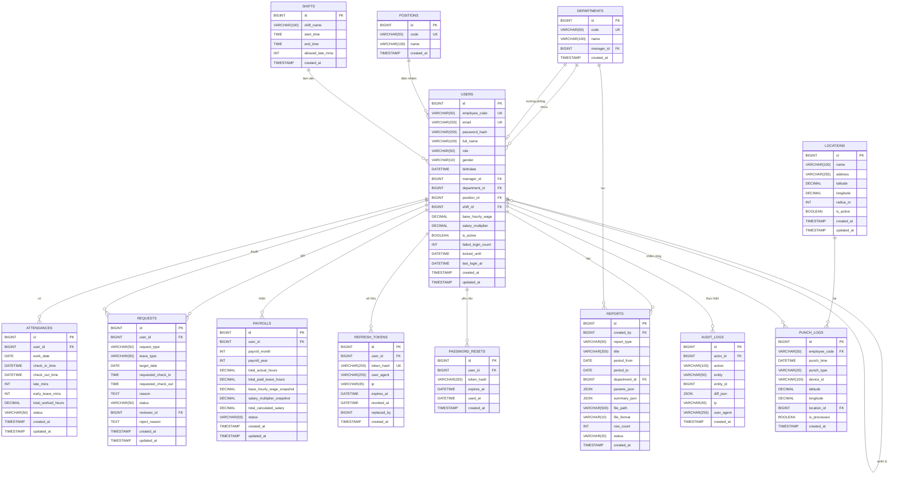

# Entity Relationship Diagram (ERD) — Hệ thống HRIS

Sơ đồ thực thể - quan hệ (ERD) của hệ thống Quản lý nhân sự (HRIS), sử dụng **ký pháp Crow's Foot** (chân gà), thể hiện đầy đủ:

- Khóa chính (**PK**)
- Khóa ngoại (**FK**)
- Ràng buộc duy nhất (**UK**)
- Cardinality (1:1, 1:N, N:N)
- Kiểu dữ liệu vật lý của từng cột

Nguồn: [backend/schema.sql](backend/schema.sql) và [backend/migrations/](backend/migrations/).

---

## 1. Sơ đồ ERD tổng thể

---

## 2. Ý nghĩa ký pháp Crow's Foot

| Ký hiệu Mermaid | Ý nghĩa |
|-----------------|---------|
| `||--||` | One-to-One bắt buộc cả hai phía |
| `||--o{` | One-to-Many (1 — N), bên N có thể không có |
| `||--o\|` | One-to-One tùy chọn ở phía bên phải |
| `}o--o{` | Many-to-Many (N — N) |
| `\|o--o\|` | Zero hoặc One ở cả hai phía |

---

## 3. Bảng quan hệ chi tiết

| Bảng cha | Bảng con | Khóa ngoại | Cardinality | Hành vi xóa | Ý nghĩa |
|----------|----------|------------|-------------|-------------|---------|
| `users` | `users` | `manager_id` | 1 — 0..N | SET NULL | Tự tham chiếu — cấp trên trực tiếp |
| `departments` | `users` | `department_id` | 1 — 0..N | SET NULL | Nhân viên thuộc phòng ban |
| `users` | `departments` | `manager_id` | 1 — 0..1 | SET NULL | Trưởng phòng của phòng ban |
| `positions` | `users` | `position_id` | 1 — 0..N | SET NULL | Chức vụ của nhân viên |
| `shifts` | `users` | `shift_id` | 1 — 0..N | SET NULL | Ca làm việc của nhân viên |
| `users` | `attendances` | `user_id` | 1 — 0..N | CASCADE | Bản ghi chấm công của nhân viên |
| `users` | `punch_logs` | `employee_code` | 1 — 0..N | (logic) | Log chấm công gắn với mã NV |
| `locations` | `punch_logs` | `location_id` | 1 — 0..N | SET NULL | Vị trí GPS của lần chấm công |
| `users` | `requests` | `user_id` | 1 — 0..N | CASCADE | Đơn từ do nhân viên gửi |
| `users` | `requests` | `reviewer_id` | 1 — 0..N | SET NULL | Đơn từ do người duyệt xử lý |
| `users` | `payrolls` | `user_id` | 1 — 0..N | CASCADE | Bảng lương của nhân viên |
| `users` | `refresh_tokens` | `user_id` | 1 — 0..N | CASCADE | Token đăng nhập của user |
| `users` | `password_resets` | `user_id` | 1 — 0..N | CASCADE | Token reset mật khẩu |
| `users` | `reports` | `created_by` | 1 — 0..N | NO ACTION | Báo cáo do user tạo |
| `departments` | `reports` | `department_id` | 1 — 0..N | SET NULL | Báo cáo lọc theo phòng ban |
| `users` | `audit_logs` | `actor_id` | 1 — 0..N | SET NULL | Lịch sử thao tác của user |

---

## 4. Khóa chính, khóa duy nhất

| Bảng | Khóa chính (PK) | Khóa duy nhất (UK) |
|------|-----------------|--------------------|
| `users` | `id` | `email`, `employee_code` |
| `departments` | `id` | `code` |
| `positions` | `id` | `code` |
| `shifts` | `id` | — |
| `locations` | `id` | — |
| `punch_logs` | `id` | `(employee_code, punch_time)` |
| `attendances` | `id` | `(user_id, work_date)` |
| `requests` | `id` | — |
| `payrolls` | `id` | `(user_id, payroll_month, payroll_year)` |
| `refresh_tokens` | `id` | `token_hash` |
| `password_resets` | `id` | — |
| `reports` | `id` | — |
| `audit_logs` | `id` | — |

---

## 5. Ràng buộc miền giá trị (CHECK / ENUM)

Các cột sau được giới hạn giá trị bằng quy ước nghiệp vụ (kiểm tra ở tầng ứng dụng):

| Bảng | Cột | Tập giá trị hợp lệ |
|------|-----|---------------------|
| `users` | `role` | `ADMIN`, `HR`, `MANAGER`, `ACCOUNTANT`, `USER` |
| `users` | `gender` | `MALE`, `FEMALE`, `OTHER` |
| `punch_logs` | `punch_type` | `IN`, `OUT`, `UNKNOWN` |
| `attendances` | `status` | `PRESENT`, `LATE`, `MISSING_CHECKOUT`, `ABSENT` |
| `requests` | `request_type` | `LEAVE_REQUEST`, `MISSING_PUNCH` |
| `requests` | `leave_type` | `PAID`, `UNPAID` |
| `requests` | `status` | `PENDING`, `APPROVED`, `REJECTED` |
| `payrolls` | `status` | `DRAFT`, `MANAGER_APPROVED`, `USER_CONFIRMED` |
| `payrolls` | `payroll_month` | 1 – 12 |
| `reports` | `report_type` | `ATTENDANCE_SUMMARY`, `PAYROLL_SUMMARY`, `HEADCOUNT`, `LEAVE_SUMMARY` |
| `reports` | `file_format` | `PDF`, `XLSX` |
| `reports` | `status` | `GENERATED`, `EMPTY`, `FAILED` |

---

## 6. Bảng đếm cột & Index khuyến nghị

| Bảng | Số cột | Index quan trọng |
|------|--------|------------------|
| `users` | 18 | `email`, `employee_code`, `manager_id`, `department_id` |
| `departments` | 5 | `code`, `manager_id` |
| `positions` | 4 | `code` |
| `shifts` | 6 | — |
| `locations` | 9 | `is_active` |
| `punch_logs` | 11 | `(employee_code, punch_time)`, `is_processed` |
| `attendances` | 11 | `(user_id, work_date)`, `work_date` |
| `requests` | 13 | `user_id`, `reviewer_id`, `status`, `target_date` |
| `payrolls` | 11 | `(user_id, payroll_month, payroll_year)`, `status` |
| `refresh_tokens` | 9 | `token_hash`, `user_id`, `expires_at` |
| `password_resets` | 6 | `token_hash`, `user_id` |
| `reports` | 13 | `created_by`, `created_at`, `report_type` |
| `audit_logs` | 9 | `actor_id`, `created_at`, `action`, `entity` |

**Tổng cộng:** 13 bảng, 125+ cột.

---

## 7. Tổ hợp tài liệu KLTN

| File | Vai trò | Mức độ |
|------|---------|--------|
| [DAM.md](DAM.md) | Phân tích miền (concept + tiếng Việt) | Phân tích |
| **ERD.md** (file này) | Thiết kế CSDL vật lý (bảng + PK/FK + cardinality) | Thiết kế CSDL |
| [diagram.md](diagram.md) | Thiết kế lớp UML (class + method + enum) | Thiết kế phần mềm |

Ba file này tạo thành bộ tài liệu **phân tích → thiết kế CSDL → thiết kế lớp** đầy đủ cho khóa luận.

---

*ERD được sinh từ schema thực tế của hệ thống — [backend/schema.sql](backend/schema.sql), [backend/migrations/001_init.sql](backend/migrations/001_init.sql), [backend/migrations/002_auth_extras.sql](backend/migrations/002_auth_extras.sql), [backend/migrations/003_locations.sql](backend/migrations/003_locations.sql), [backend/migrations/004_reports_audit.sql](backend/migrations/004_reports_audit.sql).*
