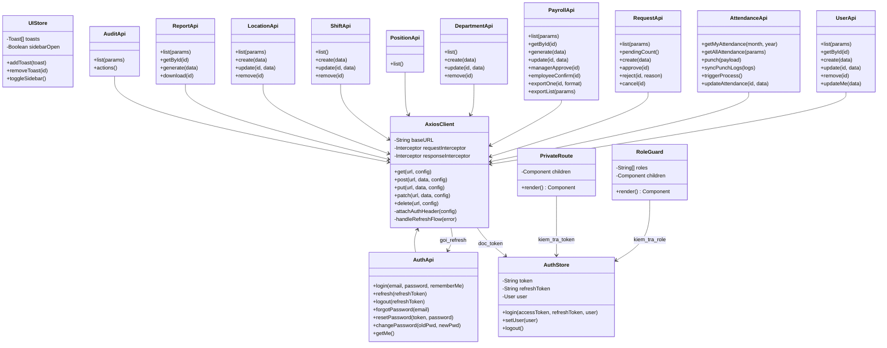
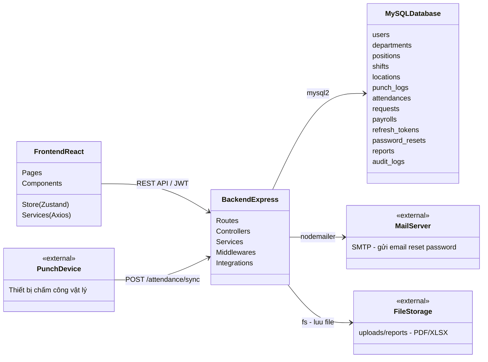

# Class Diagram — Hệ thống HRIS (Human Resource Information System)

Tài liệu này mô tả sơ đồ lớp (UML Class Diagram) của hệ thống HRIS, gồm 3 phần:

1. **Sơ đồ lớp thực thể (Domain / Entity)** — Tương ứng các bảng trong CSDL.
2. **Sơ đồ lớp tầng dịch vụ Backend (Service Layer)** — Các module nghiệp vụ.
3. **Sơ đồ lớp tầng Frontend (Store & Service)** — State management & API client.

---

## 1. Sơ đồ lớp thực thể (Domain Model)

Sơ đồ dưới đây phản ánh toàn bộ bảng trong [backend/schema.sql](backend/schema.sql) và các migration trong [backend/migrations/](backend/migrations/).

```mermaid
classDiagram
    direction LR

    class User {
        +BigInt id
        +String employee_code
        +String email
        +String password_hash
        +String full_name
        +Role role
        +Gender gender
        +DateTime birthdate
        +Decimal base_hourly_wage
        +Decimal salary_multiplier
        +Boolean is_active
        +Int failed_login_count
        +DateTime locked_until
        +DateTime last_login_at
        +BigInt manager_id
        +BigInt department_id
        +BigInt position_id
        +BigInt shift_id
        +DateTime created_at
        +DateTime updated_at
    }

    class Department {
        +BigInt id
        +String code
        +String name
        +BigInt manager_id
        +DateTime created_at
    }

    class Position {
        +BigInt id
        +String code
        +String name
        +DateTime created_at
    }

    class Shift {
        +BigInt id
        +String shift_name
        +Time start_time
        +Time end_time
        +Int allowed_late_mins
        +DateTime created_at
    }

    class Location {
        +BigInt id
        +String name
        +String address
        +Decimal latitude
        +Decimal longitude
        +Int radius_m
        +Boolean is_active
        +DateTime created_at
        +DateTime updated_at
    }

    class PunchLog {
        +BigInt id
        +String employee_code
        +DateTime punch_time
        +PunchType punch_type
        +String device_id
        +Decimal latitude
        +Decimal longitude
        +BigInt location_id
        +Boolean is_processed
        +DateTime created_at
    }

    class Attendance {
        +BigInt id
        +BigInt user_id
        +Date work_date
        +DateTime check_in_time
        +DateTime check_out_time
        +Int late_mins
        +Int early_leave_mins
        +Decimal total_worked_hours
        +AttendanceStatus status
        +DateTime created_at
        +DateTime updated_at
    }

    class Request {
        +BigInt id
        +BigInt user_id
        +RequestType request_type
        +LeaveType leave_type
        +Date target_date
        +Time requested_check_in
        +Time requested_check_out
        +String reason
        +RequestStatus status
        +BigInt reviewer_id
        +String reject_reason
        +DateTime created_at
        +DateTime updated_at
    }

    class Payroll {
        +BigInt id
        +BigInt user_id
        +Int payroll_month
        +Int payroll_year
        +Decimal total_actual_hours
        +Decimal total_paid_leave_hours
        +Decimal base_hourly_wage_snapshot
        +Decimal salary_multiplier_snapshot
        +Decimal total_calculated_salary
        +PayrollStatus status
        +DateTime created_at
        +DateTime updated_at
    }

    class RefreshToken {
        +BigInt id
        +BigInt user_id
        +String token_hash
        +String user_agent
        +String ip
        +DateTime expires_at
        +DateTime revoked_at
        +BigInt replaced_by
        +DateTime created_at
    }

    class PasswordReset {
        +BigInt id
        +BigInt user_id
        +String token_hash
        +DateTime expires_at
        +DateTime used_at
        +DateTime created_at
    }

    class Report {
        +BigInt id
        +BigInt created_by
        +ReportType report_type
        +String title
        +Date period_from
        +Date period_to
        +BigInt department_id
        +JSON params_json
        +JSON summary_json
        +String file_path
        +FileFormat file_format
        +Int row_count
        +ReportStatus status
        +DateTime created_at
    }

    class AuditLog {
        +BigInt id
        +BigInt actor_id
        +String action
        +String entity
        +BigInt entity_id
        +JSON diff_json
        +String ip
        +String user_agent
        +DateTime created_at
    }

    class Role {
        <<enumeration>>
        ADMIN
        HR
        MANAGER
        USER
        ACCOUNTANT
    }

    class Gender {
        <<enumeration>>
        MALE
        FEMALE
        OTHER
    }

    class PunchType {
        <<enumeration>>
        IN
        OUT
        UNKNOWN
    }

    class AttendanceStatus {
        <<enumeration>>
        PRESENT
        LATE
        MISSING_CHECKOUT
        ABSENT
    }

    class RequestType {
        <<enumeration>>
        LEAVE_REQUEST
        MISSING_PUNCH
    }

    class LeaveType {
        <<enumeration>>
        PAID
        UNPAID
    }

    class RequestStatus {
        <<enumeration>>
        PENDING
        APPROVED
        REJECTED
    }

    class PayrollStatus {
        <<enumeration>>
        DRAFT
        MANAGER_APPROVED
        USER_CONFIRMED
    }

    class ReportType {
        <<enumeration>>
        ATTENDANCE_SUMMARY
        PAYROLL_SUMMARY
        HEADCOUNT
        LEAVE_SUMMARY
    }

    class ReportStatus {
        <<enumeration>>
        GENERATED
        EMPTY
        FAILED
    }

    class FileFormat {
        <<enumeration>>
        PDF
        XLSX
    }

    User "1" --> "0..1" User : manager
    User "0..*" --> "0..1" Department : thuoc_ve
    User "0..*" --> "0..1" Position : giu_chuc_vu
    User "0..*" --> "0..1" Shift : lam_ca
    Department "1" --> "0..1" User : duoc_quan_ly_boi

    User "1" --> "0..*" Attendance : co
    User "1" --> "0..*" Request : tao
    User "1" --> "0..*" Request : duyet
    User "1" --> "0..*" Payroll : nhan_luong
    User "1" --> "0..*" RefreshToken : so_huu
    User "1" --> "0..*" PasswordReset : yeu_cau
    User "1" --> "0..*" Report : tao_bao_cao
    User "1" --> "0..*" AuditLog : thuc_hien

    PunchLog "0..*" --> "0..1" Location : tai_vi_tri
    PunchLog "0..*" --> "1" User : cham_cong_boi
    Report "0..*" --> "0..1" Department : loc_theo

    User ..> Role : uses
    User ..> Gender : uses
    PunchLog ..> PunchType : uses
    Attendance ..> AttendanceStatus : uses
    Request ..> RequestType : uses
    Request ..> LeaveType : uses
    Request ..> RequestStatus : uses
    Payroll ..> PayrollStatus : uses
    Report ..> ReportType : uses
    Report ..> ReportStatus : uses
    Report ..> FileFormat : uses
```



### Giải thích quan hệ chính

| Quan hệ | Ý nghĩa |
|---------|---------|
| `User --> User (manager)` | Tự tham chiếu: một nhân viên có một cấp quản lý trực tiếp. |
| `User --> Department` | Một nhân viên thuộc một phòng ban, phòng ban có nhiều nhân viên. |
| `Department --> User (manager)` | Một phòng ban do một nhân viên làm trưởng phòng. |
| `User --> Attendance` | Mỗi nhân viên có nhiều bản ghi chấm công (mỗi ngày một bản ghi). |
| `User --> Request` | Nhân viên gửi đơn (nghỉ phép / bổ sung chấm công). Một nhân viên khác đóng vai trò `reviewer`. |
| `User --> Payroll` | Mỗi nhân viên có một bảng lương theo tháng/năm (unique). |
| `PunchLog --> User` | Log chấm công liên kết với User qua `employee_code`. |
| `PunchLog --> Location` | Log chấm công gắn với vị trí geofence khi punch bằng GPS. |

---

## 2. Sơ đồ lớp tầng Backend Service

Mỗi module backend theo mô hình **Route → Controller → Service → Database**. Dưới đây là các lớp service chính trong [backend/src/modules/](backend/src/modules/).

```mermaid
classDiagram
    direction TB

    class AuthService {
        +login(email, password, rememberMe, ua, ip) TokenPair
        +refresh(refreshToken, ua, ip) TokenPair
        +logout(refreshToken) void
        +forgotPassword(email) void
        +resetPassword(token, password) void
        +changePassword(userId, oldPwd, newPwd) void
        +getMe(userId) User
        -recordFailedLogin(userId) void
        -resetFailedLogin(userId) void
        -issueTokens(user, options) TokenPair
    }

    class UserService {
        +listUsers(filters) PagedList~User~
        +getUserById(id) User
        +createUser(data) BigInt
        +updateUser(id, data) void
        +softDeleteUser(id) void
        +updateMe(id, data) void
    }

    class AttendanceService {
        +punch(userId, type, lat, lng, deviceId) Attendance
        +syncPunchLogs(logs) int
        +processPunchLogs() int
        +getMyAttendance(userId, month, year) List~Attendance~
        +getAllAttendance(filters) List~Attendance~
        +editAttendance(id, data) void
        -computeAttendanceFromPunches(punches, shift) Attendance
    }

    class RequestService {
        +listRequests(filters) PagedList~Request~
        +countPending(scope) int
        +getById(id) Request
        +createRequest(userId, data) BigInt
        +approveRequest(id, reviewer) void
        +rejectRequest(id, reviewer, reason) void
        +cancelOwnRequest(id, userId) void
    }

    class PayrollService {
        +listPayrolls(filters) PagedList~Payroll~
        +getDetail(id) Payroll
        +generateForUsers(params) List~Payroll~
        +update(id, data) void
        +managerApprove(id) void
        +employeeConfirm(id) void
        +exportOne(id, format) Buffer
        +exportList(params) Buffer
        -calculatePayrollForUser(conn, params) Payroll
    }

    class DepartmentService {
        +getAllDepartments() List~Department~
        +createDepartment(code, name, managerId) BigInt
        +updateDepartment(id, name, managerId) void
        +removeDepartment(id) void
    }

    class PositionService {
        +getAllPositions() List~Position~
        +createPosition(code, name) BigInt
        +updatePosition(id, name) void
    }

    class ShiftService {
        +getAllShifts() List~Shift~
        +createShift(data) BigInt
        +updateShift(id, data) void
        +removeShift(id) void
    }

    class LocationService {
        +listLocations(filters) List~Location~
        +getById(id) Location
        +createLocation(data) BigInt
        +updateLocation(id, data) void
        +removeLocation(id) void
    }

    class ReportService {
        +generate(params) Report
        +listReports(filters) PagedList~Report~
        +getById(id) Report
        +download(id) Stream
        -aggregate(type, params) Array
        -computeSummary(type, rows) Object
    }

    class AuditService {
        +list(filters, pagination) PagedList~AuditLog~
        +listActions() List~String~
    }

    class DashboardService {
        +adminOverview() DashboardStats
    }

    class VerifyTokenMiddleware {
        +verifyToken(req, res, next)
    }

    class CheckRoleMiddleware {
        +checkRole(roles) Middleware
    }

    class Mailer {
        +sendResetPasswordEmail(email, token)
    }

    class ReportBuilder {
        +buildExcel(rows, meta) Buffer
        +buildPDF(rows, meta) Buffer
    }

    class GeoUtil {
        +isWithinRadius(lat1, lng1, lat2, lng2, radiusM) boolean
        +distanceMeters(lat1, lng1, lat2, lng2) number
    }

    AuthService ..> Mailer : gui_email
    ReportService ..> ReportBuilder : build_file
    AttendanceService ..> GeoUtil : check_geofence
    LocationService ..> GeoUtil : validate

    UserService ..> AuditService : ghi_nhat
    AttendanceService ..> AuditService : ghi_nhat
    PayrollService ..> AuditService : ghi_nhat
    RequestService ..> AuditService : ghi_nhat
```



### Bảng module tương ứng

| Service | Module path | Entity chính |
|---------|-------------|--------------|
| AuthService | [backend/src/modules/auth/](backend/src/modules/auth/) | User, RefreshToken, PasswordReset |
| UserService | [backend/src/modules/users/](backend/src/modules/users/) | User |
| AttendanceService | [backend/src/modules/attendance/](backend/src/modules/attendance/) | Attendance, PunchLog |
| RequestService | [backend/src/modules/requests/](backend/src/modules/requests/) | Request |
| PayrollService | [backend/src/modules/payrolls/](backend/src/modules/payrolls/) | Payroll |
| DepartmentService | [backend/src/modules/departments/](backend/src/modules/departments/) | Department |
| PositionService | [backend/src/modules/positions/](backend/src/modules/positions/) | Position |
| ShiftService | [backend/src/modules/shifts/](backend/src/modules/shifts/) | Shift |
| LocationService | [backend/src/modules/locations/](backend/src/modules/locations/) | Location |
| ReportService | [backend/src/modules/reports/](backend/src/modules/reports/) | Report |
| AuditService | [backend/src/modules/audit/](backend/src/modules/audit/) | AuditLog |

---

## 3. Sơ đồ lớp tầng Frontend

Frontend React + Vite sử dụng **Zustand** cho state management và **Axios** cho API client. Xem [frontend/src/services/api.js](frontend/src/services/api.js) và [frontend/src/store/](frontend/src/store/).



---

## 4. Sơ đồ tổng quan kiến trúc



---

## 5. Các luồng nghiệp vụ chính

### 5.1 Luồng chấm công (Attendance Pipeline)

```
PunchDevice / User mobile
     │ POST /attendance/punch  hoặc  POST /attendance/sync
     ▼
punch_logs (is_processed = false)
     │ POST /attendance/process  (cron / manual)
     ▼
AttendanceService.processPunchLogs()
  - Nhóm theo (employee_code, work_date)
  - Tính check_in, check_out, late_mins, status
     ▼
attendances (upsert)
```

### 5.2 Luồng duyệt đơn (Request Approval)

```
User → POST /requests  (PENDING)
     ▼
Manager/HR → PATCH /requests/:id/approve
  - LEAVE_REQUEST: chỉ set APPROVED (dùng khi tính lương)
  - MISSING_PUNCH: upsert attendance (recalc late/hours)
     ▼
requests.status = APPROVED, reviewer_id = <approver>
```

### 5.3 Luồng tính lương (Payroll Generation)

```
ADMIN/HR → POST /payrolls/generate  (month, year, scope)
     │
     ▼ với mỗi user trong phạm vi:
     SUM(total_worked_hours) FROM attendances
     SUM(hours)             FROM requests (APPROVED LEAVE)
     salary = (actual + paid_leave) × base_wage × multiplier
     ▼
payrolls (DRAFT)
     │ Manager duyệt
     ▼
payrolls (MANAGER_APPROVED)
     │ Nhân viên xác nhận
     ▼
payrolls (USER_CONFIRMED)
     │ Export
     ▼
PDF / XLSX
```

### 5.4 Luồng xác thực (Auth + Refresh Token Rotation)

```
POST /auth/login
  → kiểm tra email + password (bcrypt)
  → kiểm tra failed_login_count, locked_until
  → cấp accessToken + refreshToken (lưu hash)

POST /auth/refresh
  → verify refreshToken
  → nếu đã bị revoke → REVOKE ALL (phát hiện tái sử dụng)
  → rotate: cấp cặp mới, đánh dấu cũ replaced_by

POST /auth/logout
  → revoke refresh token trong DB
```

---

## 6. Phân quyền (Role-based Access Control)

| Role | Phạm vi |
|------|---------|
| **ADMIN** | Toàn quyền: quản lý user, audit, cấu hình hệ thống. |
| **HR** | Quản lý nhân sự, tạo lương, tạo báo cáo, xem audit. |
| **MANAGER** | Xem/duyệt chấm công & đơn trong phòng ban mình quản lý. |
| **ACCOUNTANT** | Tạo & xuất bảng lương. |
| **USER** | Xem dữ liệu của chính mình, gửi đơn, chấm công. |

---

*Sơ đồ được sinh từ cấu trúc mã nguồn thực tế — [backend/schema.sql](backend/schema.sql), [backend/src/modules/](backend/src/modules/), [frontend/src/](frontend/src/).*
